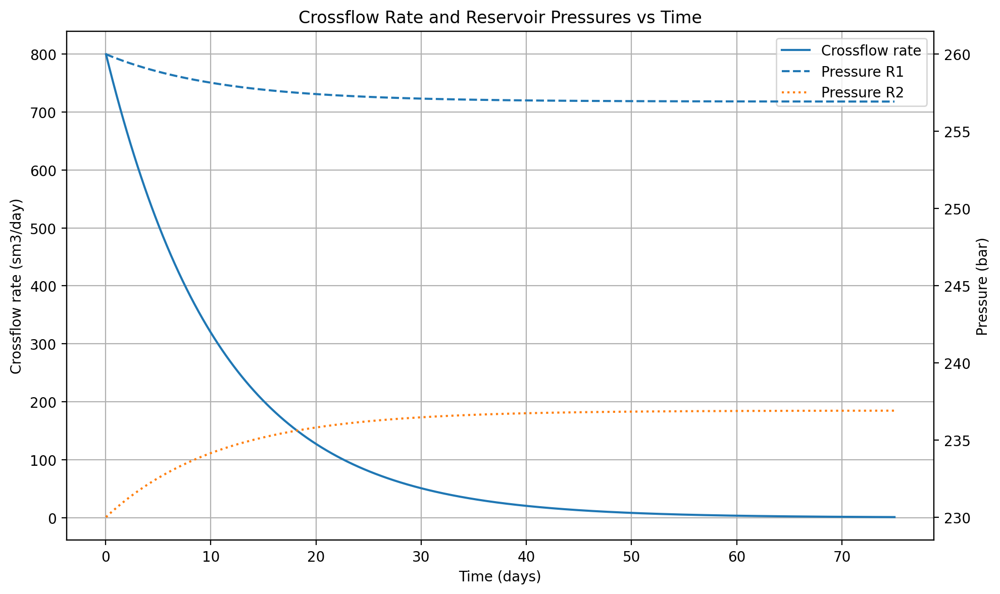
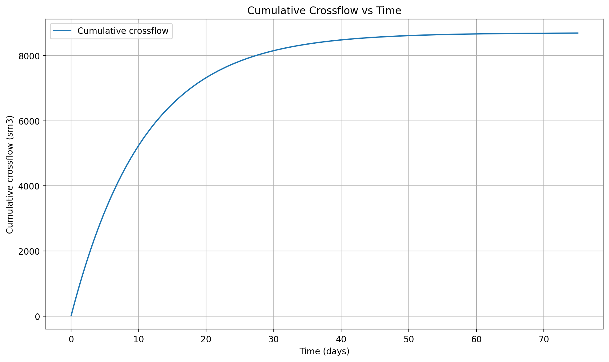

# XFlow

A Python tool for shut-in wellbore crossflow between isolated reservoirs and OPM Flow benchmark.

The repository contains:

- a lumped two-tank Python model;
- an Eclipse/OPM Flow benchmark deck;
- analytical checks for the simplified model;
- automated tests;
- benchmark results from the validated synthetic case.

## Physical problem

Two reservoirs do not communicate through the formation. They communicate only through a common wellbore.

- Surface well rate: zero.
- Downhole connections: open.
- Crossflow continues until the reservoir pressure difference equals the hydrostatic head between the two completion depths.

